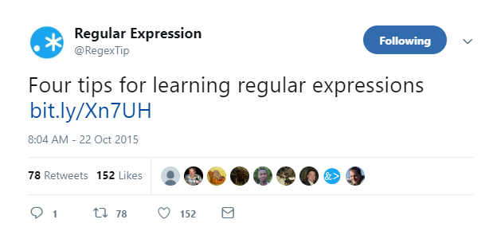

```{r setup, include=FALSE}
knitr::opts_chunk$set(echo = TRUE)
library(dpiR)
```

## What do you want to do?

- Processing
  - `base`
  - more standardized?, then `stringr`
  - need even more?, then `stringi`
- Fuzzy Matching
  - `stringdist`
  
Also  
  
- Analyzing
  - Natural Language Processing (https://cran.rstudio.com/web/views/NaturalLanguageProcessing.html)
- Visualizing
  - word clouds: `wordcloud` or `wordcloud2` or `ggwordcloud` or `modelwordcloud`
  - other ???

## But first: Regular Expressions

The only thing regular about them is their name :)

- A systematic way to define a search pattern.
- The basis of much of the string processing stuff in R.
- Also called *regexes*

Each regex patter consists of metacharacters and regular characters.

Metacharacters stand for patterns.  In R's regex system, they are `. \ | ( ) [ { ^ $ * + ?`

Regular characters are literal ... they are what they are.

The following example will match any valid email address (according to the internet):
`\\b[a-zA-Z0-9._%+-]+@[a-zA-Z0-9.-]+\\.[a-zA-Z]{2,4}\\b` 


## Regex Resources

[Regex Cheatsheet](https://www.rstudio.com/wp-content/uploads/2016/09/RegExCheatsheet.pdf)

[Regex Explanation in `stringr`](https://stringr.tidyverse.org/articles/regular-expressions.html)

[?regex](https://www.rdocumentation.org/packages/base/versions/3.5.2/topics/regex)



https://regexr.com/ for hands on testing of regex patterns

## Regex Examples (1)

```{r}
dpiR::sanitizeNames
```

```{r}
dpiR::sanitizeNames(c("O'Keefe Middle", "Bristol #4", "Science & Technology"))
```

## Regex Examples (2)

- Letter A through E, regardless of capitalization `[A-E,a-e]`
```{r}
#To get all matches use str_extract_all()
stringr::str_extract(c("123d 123 12 dkagda 151345a452", "234j ad", "gjf"), 
                     "[A-Ea-e]")
```

- One or more numerals in a row `[0-9]+`
```{r}
stringr::str_extract_all(c("123d 123 12 dkagda 151345a452", "234j ad", "gjf"), 
                         "[0-9]+")
```

- Zero or more numerals in a row `[0-9]*`
```{r}
stringr::str_extract_all(c("123d 123 12 dkagda 151345a452", "234j ad", "gjf"), 
                         "[0-9]*")
```


- Match at least one numeral at the beginning of a string `^[0-9]+`
```{r}
stringr::str_extract_all(c("123d 123 12 dkagda 151345a452", "234j ad", "gjf"), 
                         "^[0-9]+")
```

- Match at least one numeral at the end of a string `[0-9]+$`
```{r}
stringr::str_extract_all(c("123d 123 12 dkagda 151345a452", "234j ad", "gjf"), 
                         "[0-9]+$")
```

- Finally an example of how context matters in a regex, compare `[^0-9]+` to 
`^[0-9]+` above
```{r}
stringr::str_extract_all(c("123d 123 12 dkagda 151345a452", "234j ad", "gjf"), 
                         "[^0-9]+")

```


## Processing

With Base R: 
https://jozefhajnala.gitlab.io/r/r007-string-manipulation/

With Stringr:
https://resources.rstudio.com/rstudio-cheatsheets/stringr-cheat-sheet

## Fuzzy Matching

There are probably other ways, but I have used the `stringdist` package 
(https://CRAN.R-project.org/package=stringdist).

**Use case**

At DPI we have a variety of ways that we store school and district names; 
various abbreviations, capitalizations, etc.

If people ask me about X district or Y school, I really need the id codes 
associated with them.  So I wrote some functions to help me turn names into
codes.

**Details**

The `stringdistmatrix()` function that will compare each string in a given 
vector with every string in the target vector.

The output is a matrix of distances between each pair where 0 is an exact 
match, higher values are worse matches. (I have chosen the Jaro distance 
which was developed by the US Census bureau for matching typos)  

## Finding District and School Codes.

Basic Strategy:

1. Do some basic string cleaning
    - make everything lowercase
    - remove or standardize some common words 
2. Find best match(es)
3. Be conservative and **force** human check everything that isn't an 
   exact match

## `code_DistNames()`  
```{r}
code_DistNames
```

## `code_SchNames()`
```{r}
code_SchNames
```

## Questions

What headaches have working with string/character variables given you?

Other good resources/tips
